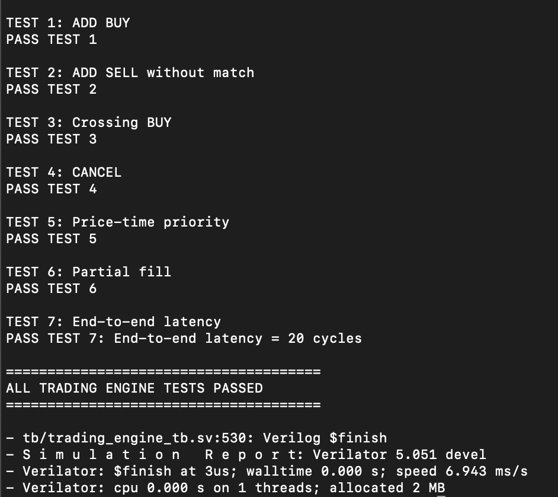
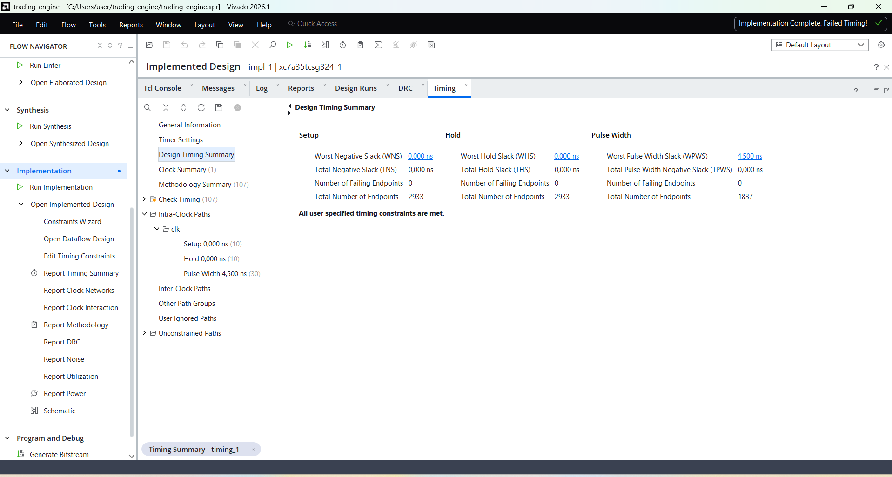
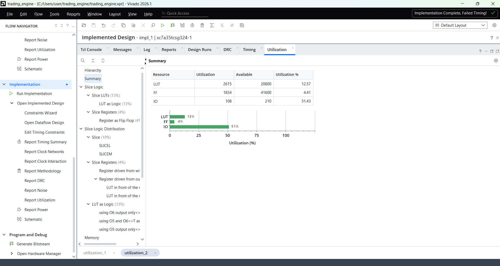

# FPGA Trading Engine

A hardware-based electronic trading engine implemented in SystemVerilog, designed to explore low-latency order processing and FPGA architectures used in electronic trading systems.

The design accepts order messages, maintains a hardware order book, performs price-time-priority matching, supports order cancellation and partial fills, and produces trade events.

The complete design was simulated with Verilator and synthesized and implemented in AMD Vivado for a Xilinx Artix-7 FPGA.

---

## Architecture

The trading engine consists of three main RTL components:

### Message Parser
Decodes incoming order messages and converts them into internal signals used by the trading engine.

### Order Book
Maintains active BUY and SELL orders and implements:

- Order insertion
- Order cancellation
- BUY/SELL matching
- Price priority
- Time priority
- Partial fills
- Best bid tracking
- Best ask tracking

### Trading Engine
Integrates the message parser and order book into the complete processing pipeline.

```text
                Incoming Order Message
                         │
                         ▼
                ┌────────────────┐
                │ Message Parser │
                └───────┬────────┘
                        │
                        ▼
                ┌────────────────┐
                │   Order Book   │
                │                │
                │ Price / Time   │
                │   Priority     │
                └───────┬────────┘
                        │
             ┌──────────┴──────────┐
             ▼                     ▼
       Market State            Trade Event
     Best Bid / Ask        Price / Qty / IDs
```

---

## Order Matching

Orders are matched using **price-time priority**.

For BUY orders, higher prices have priority.

For SELL orders, lower prices have priority.

When multiple orders exist at the same price, the oldest order is selected first.

A trade occurs when:

```text
BUY price >= best SELL price
```

or:

```text
SELL price <= best BUY price
```

The engine also supports partial fills when the quantities of the two orders are different.

---

## Verification

A SystemVerilog testbench was developed to verify the complete trading engine.

The verification suite tests:

1. BUY order insertion
2. SELL order insertion without a match
3. Crossing BUY order
4. Order cancellation
5. Price-time priority
6. Partial fills
7. End-to-end processing latency

All tests pass successfully under Verilator simulation.



The measured end-to-end latency in the testbench is:

**20 clock cycles**

---

## FPGA Implementation

The design was synthesized and implemented in AMD Vivado targeting a Xilinx Artix-7 FPGA.

### Timing

The implementation meets the specified **10 ns clock period (100 MHz)** timing constraint.

- Worst Negative Slack (WNS): **0.000 ns**
- Total Negative Slack (TNS): **0.000 ns**
- Failing setup endpoints: **0**
- Failing hold endpoints: **0**



---

## Resource Utilization

Post-implementation resource utilization:

| Resource | Used | Available | Utilization |
|----------|-----:|----------:|------------:|
| LUT | 2615 | 20800 | 12.57% |
| Flip-Flops | 1834 | 41600 | 4.41% |
| I/O | 108 | 210 | 51.43% |



---

## Project Structure

```text
fpga-trading-engine/
├── rtl/
│   ├── message_parser.sv
│   ├── order_book.sv
│   ├── trading_engine.sv
│   └── trading_pkg.sv
│
├── tb/
│   └── trading_engine_tb.sv
│
├── docs/
│   ├── simulation-results.png
│   ├── timing-closure.png
│   └── utilization.png
│
└── README.md
```

---

## Tools

- SystemVerilog
- Verilator
- AMD Vivado
- GTKWave
- Xilinx Artix-7

---

## Key Results

- Implemented a synthesizable FPGA trading engine in SystemVerilog
- Implemented hardware order-book management
- Implemented price-time-priority order matching
- Supported cancellation and partial fills
- Verified the complete design using a SystemVerilog testbench
- Passed all functional verification tests
- Achieved a measured end-to-end latency of 20 clock cycles
- Achieved timing closure at a 100 MHz target clock
- Used approximately 13% of available LUT resources and 4% of flip-flops on the target Artix-7 device

---

## Future Work

Potential extensions include:

- Higher-throughput pipelined order processing
- Multiple price levels
- Larger order-book capacity
- Market-data feed handling
- Ethernet interface integration
- Hardware risk checks
- Performance optimization for higher clock frequencies
